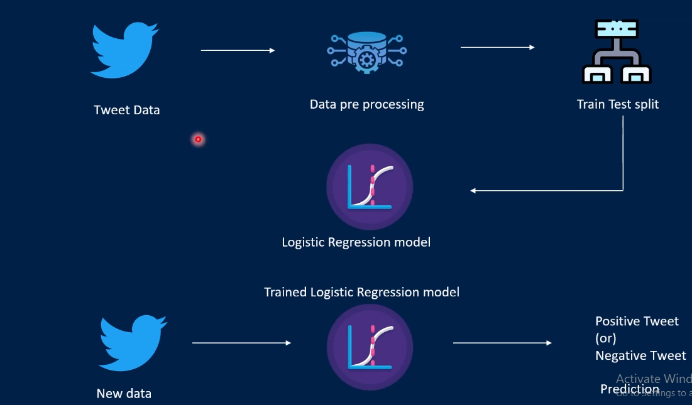

# Twitter_Sentiment_Analysis



## Overview

This project aims to perform sentiment analysis on Twitter data using machine learning techniques. It involves gathering tweets using the Kaggle Twitter dataset API, preprocessing the data, building a sentiment analysis model, and visualizing the results.

## Features

- **Tweet Collection**: Gather tweets using the Kaggle API based on specific keywords or user handles.
- **Data Preprocessing**: Clean and preprocess the collected tweets for analysis.
- **Sentiment Analysis Model**: Train a machine learning model to classify tweets into positive, negative, or neutral sentiments.

## Requirements

- Python 3.x
- Kaggle Account (for API access)
- Python libraries: pandas, numpy, scikit-learn, pickle,

## Installation

1. Clone the repository:

```bash
git clone https://github.com/yourusername/Twitter_Sentiment_Analysis.git
